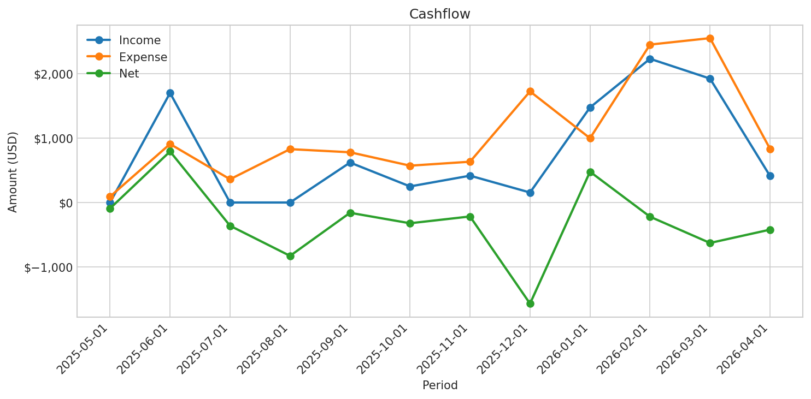
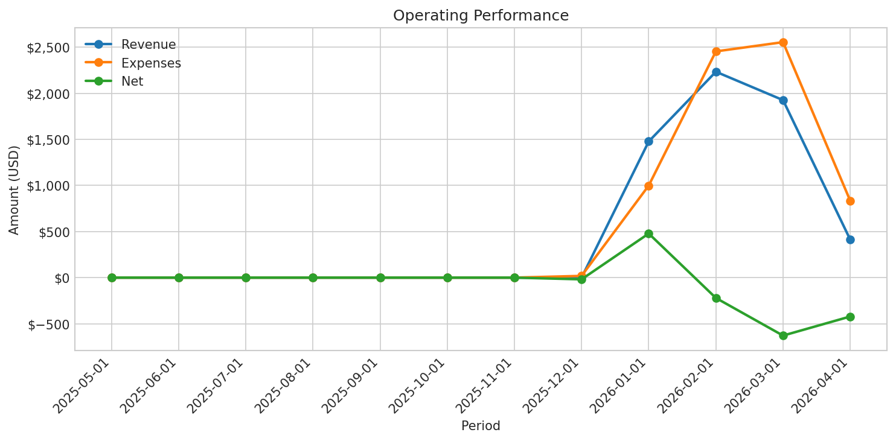
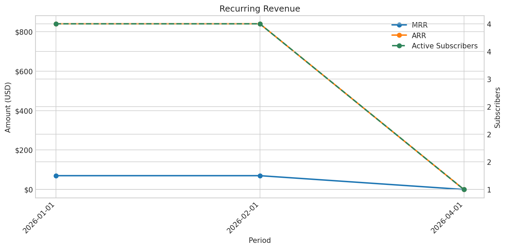

# Preconfin CFO Report

## Executive Summary

- Cash balance: $12.20
- Burn rate: $234.00/month
- Runway: 0.1 months
- Net position: -$1,278.41
- Readiness: ready
- Largest reported expense line: Uncategorized Expense at $3,370.39
- Runway warning: Runway is critically short at 0.1 months. Reduce burn or raise capital immediately.

## Cash / Burn / Runway Snapshot

- Cash balance: $12.20
- Burn rate: $234.00/month
- Runway: 0.1 months
- Active subscribers: 5
- As of: 2026-01-19T06:25:34.272891+00:00

## Top Expenses

| # | Expense | Amount | Txns |
| --- | --- | --- | --- |
| 1 | Uncategorized Expense | $3,370.39 | 34 |
| 2 | Professional Services | $645.21 | 3 |
| 3 | Loan Payment | $534.03 | 8 |
| 4 | Expense | $348.78 | 10 |
| 5 | AI / Model Spend | $303.12 | 13 |

## Recent Activity

- No recent activity returned by get_system_activity.

## Needs Attention

- Negative net: -$1,278.41

## Charts

- [Cashflow](charts/cashflow.png)

- [Operating Performance](charts/operating_performance.png)

- [Recurring Revenue](charts/recurring_revenue.png)

